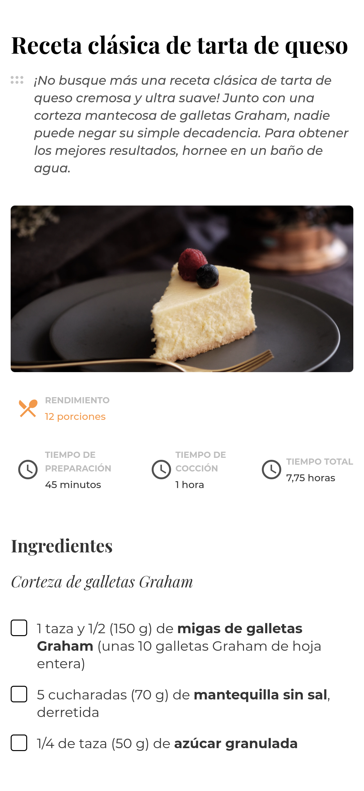

<h1 align="center">Interior Consultant | Consultora de Interiores</h1>

   Solution for a challenge from  <a href="http://devchallenges.io" target="_blank">Devchallenges.io</a>. | Solución para un desafío de <a href="http://devchallenges.io" target="_blank">Devchallenges.io</a>.

  <h3>
    <a href="https://javiervaleriano.github.io/devchallenge-recipe-page/">
      Demo
    </a>
     | 
    <a href="https://devchallenges.io/solutions/U50EToEk3Dmi24l6Q1Fd">
      Solution / Solución
    </a>
     | 
    <a href="https://devchallenges.io/challenges/OEKdUZ6xs0h99C38XVht">
      Challenge / Desafío
    </a>
  </h3>

<!-- TABLE OF CONTENTS -->

## Table of Contents | Tabla de contenido

- [Overview | Visión general](#overview--visi%C3%B3n-general)
  - [Built With | Construido con](#built-with--construido-con)
- [Features | Características](#features--caracter%C3%ADsticas)
- [Acknowledgements | Agradecimientos](#acknowledgements--agradecimientos)
- [Contact | Contacto](#contact--contacto)

<!-- OVERVIEW -->

## Overview | Visión general

### Desktop | Escritorio
.png)
.png)

### Mobile | Móvil

Hello everyone, I hope you are well. This is my [solution](https://devchallenges.io/solutions/U50EToEk3Dmi24l6Q1Fd) to [challenge](https://devchallenges.io/challenges/OEKdUZ6xs0h99C38XVht) from Devchallenges.io. |
Hola a todos, espero que estén bien. Esta es mi [solución](https://devchallenges.io/solutions/U50EToEk3Dmi24l6Q1Fd) al [desafío](https://devchallenges.io/challenges/OEKdUZ6xs0h99C38XVht) de Devchallenges.io

Here you can see my [demo](https://javiervaleriano.github.io/devchallenge-recipe-page/). | Aquí pueden ver mi [demo](https://javiervaleriano.github.io/devchallenge-recipe-page/).

In this project I use custom checkboxes and give the footer link a random URL change every 5 seconds. Also, it allowed me to reinforce my CSS Grid knowledge. |
En este proyecto utilizo checkboxes personalizados y le otorgo al enlace del footer un cambio de URL de forma aleatoria cada 5 segundos. Además, me permitió reforzar mis conocimientos de CSS Grid.

### Built With | Construido con

<!-- This section should list any major frameworks that you built your project using. Here are a few examples.-->

- [HTML](https://developer.mozilla.org/es/docs/Learn/HTML/Introduction_to_HTML)
- [CSS](https://developer.mozilla.org/es/docs/Learn/CSS)
- [JavaScript](https://developer.mozilla.org/es/docs/Web/JavaScript)

## Features | Características

<!-- List the features of your application or follow the template. Don't share the figma file here :) -->

This application/site was created as a submission to a [DevChallenges](https://devchallenges.io/challenges) challenge. The [challenge](https://devchallenges.io/challenges/OEKdUZ6xs0h99C38XVht) was to build an application to complete the given user stories | Esta aplicación/sitio se creó como una entrega a un desafío de [Devchallenges](https://devchallenges.io/challenges). El [desafío](https://devchallenges.io/challenges/OEKdUZ6xs0h99C38XVht) fue crear una aplicación para completar las historias de usuario dadas:

- User story: I can see a recipe with ingredients and instructions. | Puedo ver una receta con ingredientes e instrucciones.
- User story: I can select a checkbox if I have the ingredients. | Puedo seleccionar una casilla de verificación si tengo los ingredientes.
- User story: I can see the number of servings and baking times. | Puedo ver la cantidad de porciones y los tiempos de horneado.

## Acknowledgements | Agradecimientos

<!-- This section should list any articles or add-ons/plugins that helps you to complete the project. This is optional but it will help you in the future. For exmpale -->
- [HTML strong Tag](https://www.w3schools.com/tags/tag_strong.asp): W3School article that helps me identify when to use the HTML "strong" tag and the difference from the "b" tag. | Artículo de W3School que me ayuda a identificar cuándo usar la etiqueta "strong" de HTML y la diferencia respecto a la etiqueta "b".

- [HTML5 Element Flowchart](https://blogs.ua.es/pi/files/2012/09/h5d-sectioning-flowchart.png): HTML5 tag flowchart that helps me identify which tags to use over others. | Diagrama de flujo de etiquetas HTML5 que me ayuda a identificar qué etiquetas usar por encima de otras.

- [Cómo crear checkboxes personalizados espectaculares con tan solo CSS](https://www.jasoft.org/Blog/post/como-crear-checkboxes-personalizados-espectaculares-con-tan-solo-css): Article that helped me remember how to create custom checkboxes only with CSS. | Artículo que me ayudó a recordar cómo crear checkboxes personalizados solamente con CSS.

- [Selectores CSS avanzados](https://lenguajecss.com/css/selectores/selectores-avanzados/): Article that helped me learn more about CSS selectors and their characteristics. | Artículo que me ayudó a conocer más a fondo los selectores de CSS y sus características.

- [animation](https://developer.mozilla.org/es/docs/Web/CSS/animation): Mozilla Developer article that helped me remember the use and feature of the CSS animation property. | Artículo de Mozilla Developer que me ayudó a recordar el uso y la característica de la propiedad animation de CSS.

## Contact | Contacto

- [Devchallenges profile | Perfil de Devchallenges](https://devchallenges.io/portfolio/javiervaleriano)
- Codepen: [@javiervaleriano](https://codepen.io/javiervaleriano)
- GitHub: [@javiervaleriano](https://github.com/javiervaleriano)
- Instagram: [@javiervalerianoz](https://www.instagram.com/javiervalerianoz/)
- Twitter: [@javaleriano2](https://twitter.com/javaleriano2)
